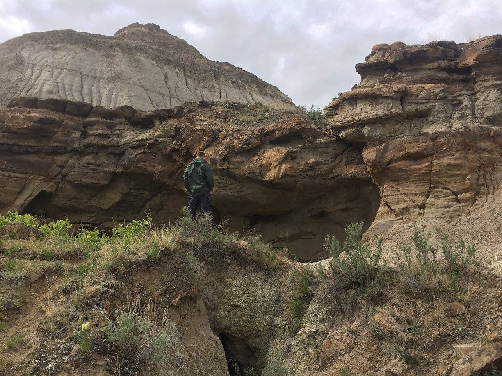

```{r setup, include=FALSE}
knitr::opts_chunk$set(echo = TRUE)
```

<br>

##Link to our independant Github Accounts

---

Matthew Pruden - https://github.com/MPruden96

Brian Toy - https://github.com/briantoy92

<br>


